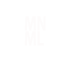

<!DOCTYPE html>
<html lang="en">
	<head>
	<meta charset="utf-8">
	<meta name="viewport" content="width=device-width, initial-scale=1.0">
	<title>Maryam Zavieh's Portfolio</title>
	<link rel="stylesheet" href="/css/styles.css">
	</head>
	<body>
		

			<section class="row topline">
			

			
			
 <!--logo -->
			

			<h1>Maryam Zavieh</h1>Front-End | Developer
			
 <!-- title -->
			</section>
		

			<main class="main-content">
			

			<!-- first & center-image -->
			

			<article class="row1 featured-work">
			 <h2>FEATURED WORK!</h2><!-- featured work -->
			</article>	
			
<!-- featured work images and text-->
			  
 <!-- second image --> 
			      
				  <h3 class="img-title">
				  <a class="cat-title1" href="https://github.com/shadiliz/Animalcard.git">
			  	Animal-Card</a></h3>
			  

			  
 <!-- third image --> 
			  
			  <h3 class="omnifood-title2"><a class="omni-food" href="https://github.com/shadiliz/Animalcard.git">
			  	Omni Food</a>
				 </h3> 
			  

			  
 <!-- forth image --> 
			   
			  <h3 class="mnml-title3"><a class="mnml" href="https://github.com/shadiliz/-mnml-sample.git">MNML</a>
				  </h3>
			  

			

		</main>
	<footer class="bottom">
	
Made with ♡ by Maryam Zavieh
    <!-- footer name -->
	
copyright &copy;2018 MZ Portfolio
<!-- copyright -->
	</footer>
 </body>
</html>
